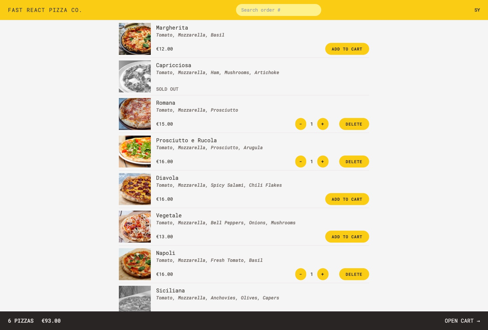
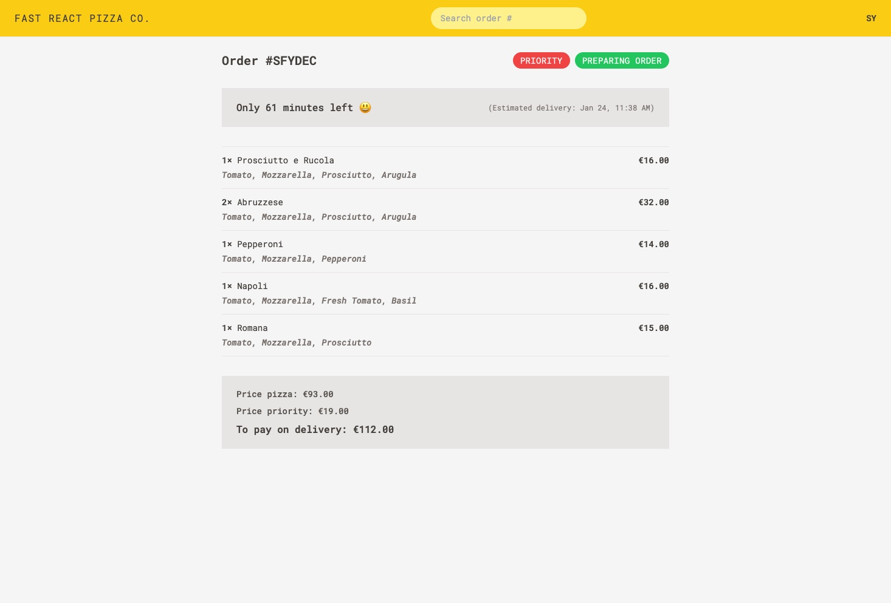

# Fast React Pizza Co.

##### Link to [React-fast-pizza](https://tmiworld-5f7c04c2f838.herokuapp.com/) (Vite + React + Tailwindcss).

---

### Description

This frontend single page application allows users to after entering their name, within a pizza menu select and add items to the cart, update or remove items from the cart. Once the cart created it can be edited (cleared), canceled or the order can be placed.

## Table of Contents

- [Technologies](#technologies)
- [Installation](#installation)
- [Visuals](#visuals)
- [Contributing](#contributing)
- [Questions](#questions)

## Technologies

- `vite`
- `React`
- `tailwindcss`
- `react-router-dom`
- `react-redux`
- `Node.js`

## Installation

Clone the reposatory.
`npm install`
`npm run dev`

## Visuals

- Menu showing on going orders status:

- Order review page:

## Contributing

A great thank you to Jonas Schmedtmann.

## Questions

If you have any questions or wish to contact me please visit the app's [Sy25](https://github.com/Saidou25).
